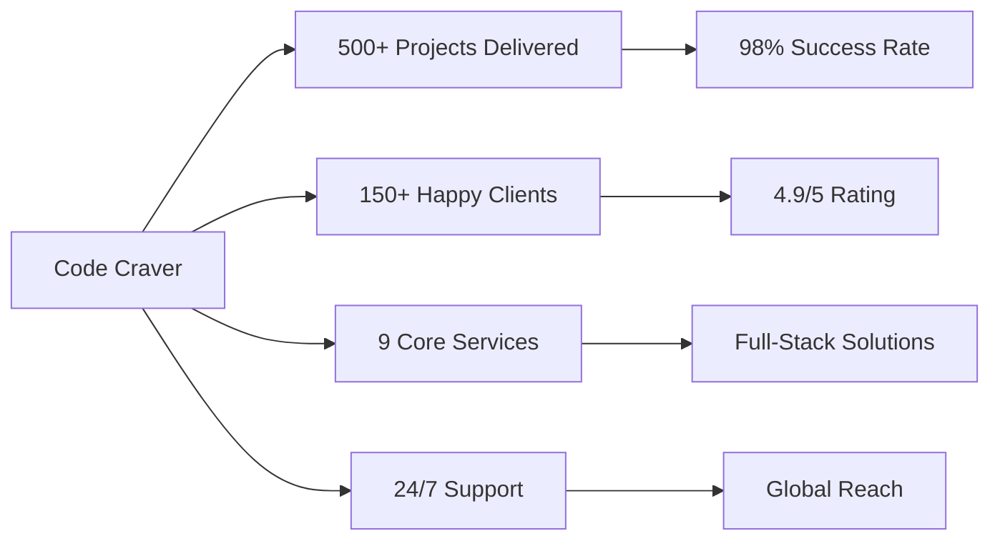
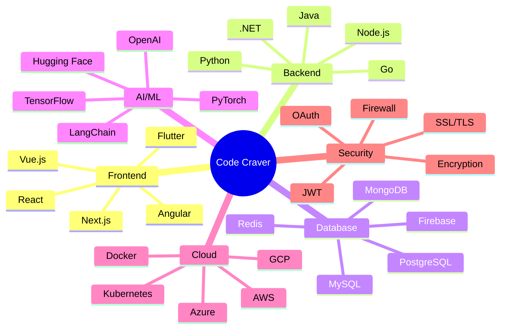
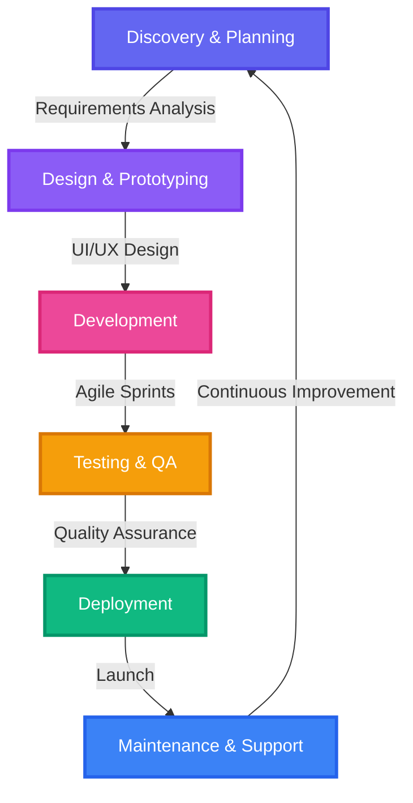
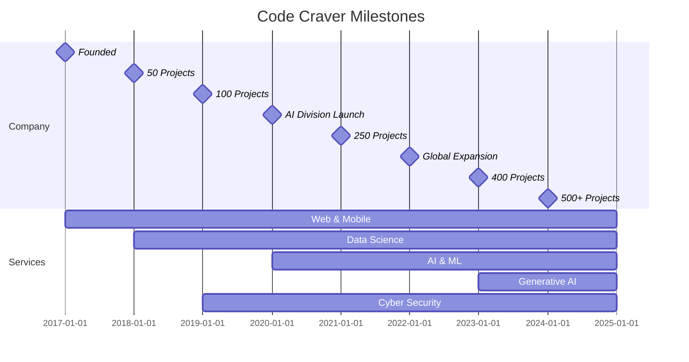

# 🚀 CODE CRAVER

### *Transforming Ideas into Digital Reality*

---

### 🎯 **Where Innovation Meets Excellence**

*We are a cutting-edge technology solutions company dedicated to empowering businesses through transformative digital experiences. From concept to deployment, we craft solutions that don't just meet expectations—they exceed them.*

---

## 📊 **Our Impact in Numbers**

| 🎯 Metric | 📈 Achievement |
|-----------|----------------|
| **Projects Completed** | 500+ |
| **Client Satisfaction** | 98% |
| **Countries Served** | 25+ |
| **Team Members** | 50+ Experts |
| **Years of Experience** | 8+ Years |
| **Technologies Mastered** | 100+ |

---

## 🌟 **Our Service Ecosystem**

<table>
<tr>
<td width="50%">

### 🌐 **Web Development**
> *Crafting Digital Experiences That Captivate*

Transform your online presence with stunning, responsive, and high-performance web applications.

**Technologies:**
- ⚛️ React, Next.js, Vue.js, Angular
- 🔧 Node.js, Express, Django, Laravel
- 🎨 Tailwind CSS, Material UI, Bootstrap
- 📦 MongoDB, PostgreSQL, MySQL, Redis

**What We Deliver:**
- ✨ Custom Website Development
- 🛍️ E-commerce Platforms
- 📱 Progressive Web Apps (PWA)
- 🔄 API Development & Integration
- ⚡ Performance Optimization

</td>
<td width="50%">

### 📱 **App Development**
> *Mobile-First Solutions for a Connected World*

Native and cross-platform applications that deliver seamless user experiences across all devices.

**Technologies:**
- 📲 React Native, Flutter, Swift
- 🤖 Kotlin, Java, Xamarin
- 🔥 Firebase, AWS Amplify
- 💾 SQLite, Realm, Core Data

**What We Deliver:**
- 📱 iOS & Android Apps
- 🔄 Cross-Platform Solutions
- 🎮 Gaming Applications
- 💼 Enterprise Mobile Apps
- 📊 Real-time Analytics Integration

</td>
</tr>
<tr>
<td width="50%">

### 📊 **Data Science**
> *Turning Data into Actionable Insights*

Unlock the power of your data with advanced analytics, machine learning, and predictive modeling.

**Technologies:**
- 🐍 Python, R, Julia
- 📈 Pandas, NumPy, SciPy
- 📊 Matplotlib, Seaborn, Plotly
- 🔬 Scikit-learn, TensorFlow

**What We Deliver:**
- 📉 Data Analysis & Visualization
- 🔮 Predictive Analytics
- 📊 Business Intelligence Dashboards
- 🧮 Statistical Modeling
- 🎯 Customer Segmentation

</td>
<td width="50%">

### 🤖 **Artificial Intelligence**
> *Intelligent Systems That Learn and Adapt*

Build AI-powered solutions that automate processes and provide intelligent decision-making capabilities.

**Technologies:**
- 🧠 TensorFlow, PyTorch, Keras
- 🎯 Computer Vision (OpenCV, YOLO)
- 🗣️ Natural Language Processing
- 🎵 Speech Recognition & Synthesis

**What We Deliver:**
- 🖼️ Image Recognition Systems
- 📝 Text Analysis & Sentiment Analysis
- 🤖 Recommendation Engines
- 🔍 Anomaly Detection
- 🎯 Predictive Maintenance

</td>
</tr>
<tr>
<td width="50%">

### ✨ **Generative AI**
> *Creating Tomorrow's Content Today*

Harness the power of cutting-edge generative models to create content, automate workflows, and innovate.

**Technologies:**
- 🎨 GPT-4, Claude, Gemini
- 🖼️ DALL-E, Midjourney, Stable Diffusion
- 🔊 Eleven Labs, Whisper
- ⚙️ LangChain, LlamaIndex

**What We Deliver:**
- 💬 AI Content Generation
- 🎨 AI Image & Video Creation
- 📝 Automated Report Writing
- 🎵 AI Music Composition
- 🔄 Code Generation & Optimization

</td>
<td width="50%">

### 💬 **Chatbot Development**
> *Conversational AI That Understands*

Intelligent chatbots that provide 24/7 customer support and enhance user engagement.

**Technologies:**
- 🤖 Dialogflow, Rasa, Botpress
- 💬 WhatsApp, Telegram, Slack APIs
- 🧠 NLP & Intent Recognition
- 🔗 Custom API Integrations

**What We Deliver:**
- 💼 Customer Support Bots
- 🛍️ E-commerce Assistants
- 📚 Knowledge Base Bots
- 🎯 Lead Generation Bots
- 🌍 Multi-language Support

</td>
</tr>
<tr>
<td width="50%">

### ⚡ **AI Automation**
> *Streamline Operations with Intelligent Automation*

End-to-end automation solutions that increase efficiency and reduce operational costs.

**Technologies:**
- 🔄 Zapier, Make, n8n
- 🤖 Robotic Process Automation
- 📊 Workflow Optimization Tools
- ☁️ Cloud Automation (AWS, Azure, GCP)

**What We Deliver:**
- 📋 Business Process Automation
- 📧 Email & Marketing Automation
- 📊 Data Pipeline Automation
- 🔄 CI/CD Pipeline Setup
- 📈 Performance Monitoring

</td>
<td width="50%">

### 🔒 **Cyber Security**
> *Protecting Your Digital Assets*

Comprehensive security solutions to safeguard your systems, data, and users from cyber threats.

**Technologies:**
- 🛡️ Penetration Testing Tools
- 🔐 Encryption & Authentication
- 🚨 SIEM Systems
- 🔍 Vulnerability Assessment

**What We Deliver:**
- 🔒 Security Audits & Assessments
- 🛡️ Penetration Testing
- 🔐 Data Encryption Solutions
- 📱 Application Security
- 🚨 Incident Response Planning

</td>
</tr>
<tr>
<td colspan="2">

### 🎮 **Game Development**
> *Immersive Gaming Experiences*

Create engaging, high-performance games across multiple platforms with stunning graphics and smooth gameplay.

**Technologies:**
- 🎯 Unity, Unreal Engine, Godot
- 🎨 Blender, Maya, 3ds Max
- 🔊 FMOD, Wwise
- 🌐 Photon, Mirror Networking

**What We Deliver:**
- 🎮 2D & 3D Game Development | 📱 Mobile Gaming | 🖥️ PC & Console Games | 🌐 Multiplayer Systems | 🎨 Game Art & Animation

</td>
</tr>
</table>

---

## 🛠️ **Technology Stack**

### **Languages & Frameworks**

### **AI/ML & Data Science**

### **Cloud & DevOps**

### **Databases**

---

## 💼 **Our Development Process**

### 🎯 **Our Methodology**

| Phase | Duration | Deliverables |
|-------|----------|--------------|
| 🔍 **Discovery** | 1-2 weeks | Requirements Doc, Project Roadmap |
| 🎨 **Design** | 2-3 weeks | Wireframes, UI/UX Designs, Prototypes |
| 💻 **Development** | 4-12 weeks | Working Software, Code Reviews |
| 🧪 **Testing** | 1-2 weeks | Test Reports, Bug Fixes |
| 🚀 **Deployment** | 1 week | Live Application, Documentation |
| 🔧 **Support** | Ongoing | Updates, Monitoring, Maintenance |

---

## 🏆 **Why Choose Code Craver?**

<table>
<tr>
<td width="33%" align="center">

### 🎯 **Expertise**
**8+ Years of Excellence**

Our team of 50+ seasoned professionals brings deep technical expertise across all domains.

</td>
<td width="33%" align="center">

### ⚡ **Innovation**
**Cutting-Edge Solutions**

We stay ahead of technology trends to deliver future-proof solutions.

</td>
<td width="33%" align="center">

### 🤝 **Partnership**
**Collaborative Approach**

We work closely with you at every step to ensure your vision becomes reality.

</td>
</tr>
<tr>
<td width="33%" align="center">

### 💎 **Quality**
**No Compromise on Excellence**

Rigorous testing and quality assurance ensure flawless delivery.

</td>
<td width="33%" align="center">

### 🚀 **Speed**
**Rapid Delivery**

Agile methodology ensures faster time-to-market without sacrificing quality.

</td>
<td width="33%" align="center">

### 💰 **Value**
**Competitive Pricing**

Premium solutions at competitive rates with transparent pricing.

</td>
</tr>
<tr>
<td width="33%" align="center">

### 🛡️ **Security**
**Fort Knox Protection**

Enterprise-grade security measures to protect your data and users.

</td>
<td width="33%" align="center">

### 📈 **Scalability**
**Built to Grow**

Solutions architected to scale seamlessly with your business.

</td>
<td width="33%" align="center">

### 🌍 **Global Reach**
**Worldwide Service**

Supporting clients across 25+ countries with 24/7 availability.

</td>
</tr>
</table>

---

## 📈 **Our Growth Journey**

---

## 🎓 **Industries We Serve**

| Industry | Solutions Delivered | Success Rate |
|----------|-------------------|--------------|
| 🏥 **Healthcare** | Patient Management, Telemedicine, AI Diagnostics | 99% |
| 🏦 **Finance** | Banking Apps, Trading Platforms, Fraud Detection | 98% |
| 🛒 **E-commerce** | Online Stores, Marketplaces, Inventory Systems | 97% |
| 📚 **Education** | LMS, E-learning Platforms, Student Portals | 98% |
| 🏭 **Manufacturing** | IoT Solutions, Predictive Maintenance, Automation | 96% |
| 🏨 **Hospitality** | Booking Systems, Guest Management, Analytics | 97% |
| 🚗 **Automotive** | Fleet Management, GPS Tracking, Diagnostics | 98% |
| 🎮 **Gaming** | Mobile Games, Console Games, Multiplayer Systems | 95% |
| 📱 **Social Media** | Platforms, Content Management, Analytics | 97% |
| 🏢 **Enterprise** | CRM, ERP, Business Intelligence, Workflows | 99% |

---

## 🌟 **Client Success Stories**

> ### *"Code Craver transformed our vision into a reality beyond our expectations. Their AI-powered solution increased our efficiency by 300%."*
> **— Sarah Johnson, CEO, TechVision Inc.**

> ### *"Outstanding work! The mobile app they developed has 4.8 stars on both stores and handles 100K+ daily users flawlessly."*
> **— Michael Chen, CTO, ShopEasy**

> ### *"Their cybersecurity audit saved us from potential threats. Professional, thorough, and highly recommended."*
> **— David Rodriguez, IT Director, SecureBank**

---

## 📞 **Let's Build Something Amazing Together**

### Ready to Transform Your Ideas into Reality?

We're excited to hear about your project and explore how we can help you achieve your goals.

<table>
<tr>
<td align="center" width="33%">

### 📧 **Email Us**
[contact@codecraver.com](mailto:contact@codecraver.com)

Drop us a message anytime

</td>
<td align="center" width="33%">

### 🌐 **Visit Our Website**
[www.codecraver.com](https://codecraver.com)

Explore our portfolio

</td>
<td align="center" width="33%">

### 💬 **Schedule a Call**
[Book a Meeting](https://calendly.com/codecraver)

Let's discuss your project

</td>
</tr>
</table>

---

### 🔗 **Connect With Us**

---

### 🎯 **Quick Links**

[📝 Get a Quote](https://codecraver.com/quote) • [👥 Our Team](https://codecraver.com/team) • [💼 Careers](https://codecraver.com/careers) • [📚 Blog](https://codecraver.com/blog) • [📄 Case Studies](https://codecraver.com/case-studies)

---

### 💡 **From Concept to Code, We've Got You Covered**

© 2024 Code Craver. All rights reserved. | Crafted with ❤️ by Code Craver Team

